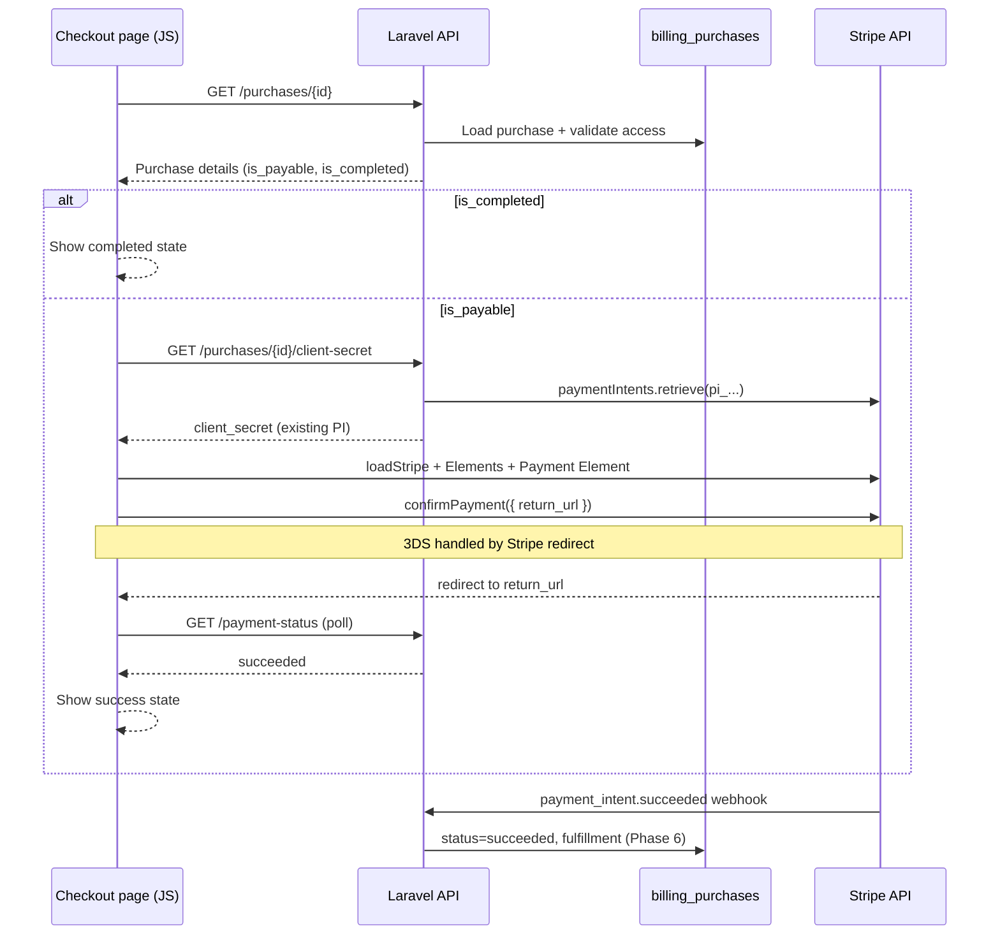

# Phase 7: Embedded Checkout UI

Replace Stripe Checkout redirects with an on-site Stripe Payment Element experience backed by existing `billing_purchases` and Payment Intents from Phase 4.

## Checkout architecture



### Design principles

- **`billing_purchases` is the source of truth** for checkout state (`status`, `fulfilled_at`, `payment_intent_id`).
- **No new Payment Intents** are created during checkout page rendering or client-secret retrieval; Phase 4 `StripePaymentIntentService::retrieve()` re-fetches the existing intent.
- **Idempotent refreshes**: succeeded purchases return `is_completed: true` and the UI shows a completed state without mounting the Payment Element.
- **Guest checkout** is limited to `COMMUNITY_DUA_PAID` purchases with `user_id = null`.
- **Legacy Checkout Sessions** (`StripeCheckoutService`, web `/billing/checkout`, `/submit-a-dua/checkout`) are unchanged.

## Modified files

| File | Change |
|------|--------|
| `app/Domains/Billing/Services/PurchaseAccessService.php` | **New** — purchase ownership / guest access rules |
| `app/Domains/Billing/Services/PurchaseService.php` | Added `findAccessible`, `clientSecretFor`, `paymentStatusFor` |
| `app/Models/BillingPurchase.php` | Added `isPayable()`, `isCompleted()` |
| `app/Http/Controllers/Api/V1/Billing/PurchaseController.php` | Added `show`, `clientSecret`, `paymentStatus` |
| `app/Http/Controllers/PurchaseCheckoutController.php` | **New** — web checkout page |
| `app/Http/Middleware/Authenticate.php` | Guest sanctum allowed on purchase read routes |
| `app/Http/Resources/Api/V1/Billing/PurchaseCheckoutResource.php` | **New** |
| `app/Http/Resources/Api/V1/Billing/PurchaseClientSecretResource.php` | **New** |
| `app/Http/Resources/Api/V1/Billing/PurchasePaymentStatusResource.php` | **New** |
| `routes/api/v1/billing.php` | Purchase read routes |
| `routes/web.php` | Checkout page route |
| `resources/views/billing/purchase-checkout.blade.php` | **New** — checkout shell |
| `resources/js/billing-checkout.js` | **New** — Stripe.js + Payment Element |
| `vite.config.js` | Added `billing-checkout.js` entry |
| `package.json` | Added `@stripe/stripe-js` |
| `tests/Feature/Api/V1/Billing/PurchaseCheckoutTest.php` | **New** |
| `tests/Feature/Billing/PurchaseCheckoutPageTest.php` | **New** |
| `tests/Feature/Billing/PurchaseAccessServiceTest.php` | **New** |

## Route map

### API (`/api/v1`)

| Method | Path | Auth | Name | Purpose |
|--------|------|------|------|---------|
| `POST` | `/billing/purchases` | sanctum (guest OK) | `api.v1.billing.purchases.store` | Create purchase + PI (Phase 4) |
| `GET` | `/billing/purchases/{purchase}` | sanctum (guest OK*) | `api.v1.billing.purchases.show` | Purchase details for checkout UI |
| `GET` | `/billing/purchases/{purchase}/client-secret` | sanctum (guest OK*) | `api.v1.billing.purchases.client-secret` | Retrieve existing PI `client_secret` |
| `GET` | `/billing/purchases/{purchase}/payment-status` | sanctum (guest OK*) | `api.v1.billing.purchases.payment-status` | Poll payment / fulfillment state |

\*Guest access only when `PurchaseAccessService` allows it (`COMMUNITY_DUA_PAID` with no owning user conflict).

### Web

| Method | Path | Auth | Name | Purpose |
|--------|------|------|------|---------|
| `GET` | `/billing/purchases/{purchase}/checkout` | optional | `billing.purchases.checkout` | Embedded checkout page |

### Unchanged legacy routes

- `POST /billing/checkout` (web + API) — Stripe Checkout Session (premium)
- `POST /submit-a-dua/checkout` — community dua Checkout Session
- `POST /api/v1/billing/webhooks/stripe` — Payment Intent webhooks

## Stripe integration details

### Backend

- **Publishable key**: `config('services.stripe.key')` / `STRIPE_KEY`
- **Client secret retrieval**: `StripePaymentIntentService::retrieve($purchase->payment_intent_id)` — never `createForPurchase` on checkout paths
- **Payable statuses**: `requires_payment_method`, `requires_confirmation`, `processing`
- **Automatic payment methods** (from Phase 4): `enabled: true`, `allow_redirects: never` — supports card, Apple Pay, Google Pay, and 3DS without off-site redirect payment methods

### Frontend (`billing-checkout.js`)

1. `loadStripe(STRIPE_KEY)`
2. Fetch purchase via API; short-circuit if `is_completed`
3. Fetch `client_secret` from `/client-secret`
4. `stripe.elements({ clientSecret })` → `elements.create('payment', { wallets: { applePay: 'auto', googlePay: 'auto' } })`
5. Submit via `stripe.confirmPayment({ elements, clientSecret, confirmParams: { return_url } })`
6. After 3DS redirect (`redirect_status` query param), poll `/payment-status` until `is_completed`

### Purchase access rules

| Product scope | Authenticated | Guest |
|---------------|---------------|-------|
| `user` | `purchase.user_id === auth.id` | Denied |
| `list` | Owns `dua_list_id` | Denied |
| `community_dua` (`COMMUNITY_DUA_PAID`) | Allowed if `user_id` null or matches | Allowed if `user_id` null |

## Test coverage

| Test file | Coverage |
|-----------|----------|
| `tests/Feature/Api/V1/Billing/PurchaseCheckoutTest.php` | API show, client-secret, payment-status; ownership; guest community dua; no PI creation on refresh; completed purchase handling |
| `tests/Feature/Billing/PurchaseCheckoutPageTest.php` | Web page access control, Stripe key guard |
| `tests/Feature/Billing/PurchaseAccessServiceTest.php` | Access service unit scenarios |

Run:

```bash
php artisan test tests/Feature/Api/V1/Billing/PurchaseCheckoutTest.php tests/Feature/Billing/PurchaseCheckoutPageTest.php tests/Feature/Billing/PurchaseAccessServiceTest.php
```

## Manual QA checklist

### Setup

- [ ] `STRIPE_KEY` and `STRIPE_SECRET` are test-mode keys
- [ ] `npm run build` or `npm run dev` is running for frontend assets
- [ ] Billing products seeded (`php artisan db:seed --class=BillingProductSeeder`)

### Authenticated product flow

- [ ] Create purchase via `POST /api/v1/billing/purchases` (authenticated)
- [ ] Open `/billing/purchases/{id}/checkout` while logged in
- [ ] Payment Element loads with product name and amount
- [ ] Pay with test card `4242 4242 4242 4242` — payment succeeds
- [ ] Page shows completed state after webhook processes
- [ ] Refresh page — completed state persists (no Payment Element)
- [ ] `client-secret` endpoint returns 409 for succeeded purchase

### Guest community dua flow

- [ ] Create `COMMUNITY_DUA_PAID` purchase without auth
- [ ] Open checkout page without logging in
- [ ] Complete payment successfully

### Access control

- [ ] Another user cannot access someone else's purchase (403)
- [ ] Guest cannot access authenticated-product checkout (401)

### Payment methods

- [ ] Card payment works
- [ ] 3DS test card `4000 0025 0000 3155` completes after challenge redirect
- [ ] Apple Pay / Google Pay appear when browser/device supports them (Stripe auto wallet detection)

### Error states

- [ ] Missing/invalid purchase ID returns 404
- [ ] Stripe unavailable shows error UI
- [ ] Failed payment (`4000 0000 0000 0002`) shows inline error without leaving page

### Regression

- [ ] Legacy `POST /billing/checkout` still redirects to Stripe Checkout
- [ ] Legacy `POST /submit-a-dua/checkout` still works
- [ ] Webhook fulfillment (Phase 6) still runs after embedded payment
