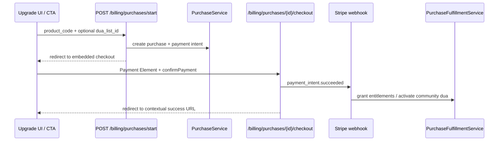

# Phase 8: Upgrade Flow Integration

Connect all upgrade entry points to the embedded billing system (`billing_purchases` + Payment Element checkout).

## Upgrade flow architecture



Legacy Stripe Checkout Sessions remain in the codebase but are marked **deprecated** and are no longer used by primary UI flows.

## Route and UI mapping

| Entry point | Route / action | Product code | Auth |
|-------------|----------------|--------------|------|
| Upgrade page cards | `POST billing.purchases.start` | Per card | auth + verified |
| Locked submission banner | `GET dashboard.upgrade?product=request_pack_25&dua_list_id=` | `REQUEST_PACK_25` | auth |
| Locked submission card CTAs | Same with list context | `REQUEST_PACK_25` | auth |
| List limit redirect | `GET dashboard.upgrade?product=additional_list` | `ADDITIONAL_LIST` | auth |
| Welcome pricing (paid plans) | `GET dashboard.upgrade?product=` or login | `UNLIMITED_ONE_LIST` / `UNLIMITED_FOREVER` | optional |
| Community dua pay button | `POST community-dua.checkout` | `COMMUNITY_DUA_PAID` | guest OK |
| Sidebar / mobile "Upgrade" | `GET dashboard.upgrade` | navigation | auth |
| Embedded checkout | `GET billing.purchases.checkout` | — | optional / auth |
| **Deprecated** legacy premium | `POST billing.checkout` | generic premium | auth |
| **Deprecated** legacy community | legacy Stripe session via old action | — | guest |

### Product mapping

| Plan slug | Product code |
|-----------|--------------|
| `request_pack_25` | `REQUEST_PACK_25` |
| `additional_list` | `ADDITIONAL_LIST` |
| `unlimited_one_list` | `UNLIMITED_ONE_LIST` |
| `unlimited_forever` | `UNLIMITED_FOREVER` |
| `community_dua_paid` | `COMMUNITY_DUA_PAID` |

## Modified files

| File | Change |
|------|--------|
| `app/Domains/Billing/Actions/StartEmbeddedPurchaseCheckoutAction.php` | **New** — create purchase for authenticated upgrades |
| `app/Domains/Community/Actions/StartPaidCommunityDuaPurchaseAction.php` | **New** — community dua + purchase |
| `app/Domains/Billing/Fulfillment/Handlers/CommunityDuaPaidFulfillmentHandler.php` | **New** — activate paid community dua |
| `app/Domains/Billing/Support/BillingProductMapper.php` | **New** — plan slug → product code |
| `app/Domains/Billing/Support/PurchaseCheckoutRedirectResolver.php` | **New** — success/failure URLs |
| `app/Http/Controllers/PurchaseCheckoutController.php` | Added `store`, contextual checkout data |
| `app/Http/Requests/Billing/StartPurchaseCheckoutRequest.php` | **New** |
| `app/Http/Controllers/Dashboard/UpgradeController.php` | Product catalog + query preselection |
| `app/Http/Controllers/CommunityDuaController.php` | Embedded checkout for paid community dua |
| `app/Domains/Billing/Services/PurchaseFulfillmentService.php` | Register community dua handler |
| `resources/views/dashboard/upgrade.blade.php` | Product-specific forms → `billing.purchases.start` |
| `resources/views/dashboard/lists/submissions.blade.php` | Contextual upgrade CTAs |
| `resources/views/welcome.blade.php` | Pricing links to upgrade/login |
| `resources/views/billing/purchase-checkout.blade.php` | Success/failure UX |
| `resources/js/billing-checkout.js` | Redirect after success, failure links |
| `routes/web.php` | `billing.purchases.start` route |
| Legacy actions/controllers | `@deprecated` annotations retained |

## Success and failure UX

| Product | Success redirect | Failure redirect |
|---------|------------------|------------------|
| `REQUEST_PACK_25` / `UNLIMITED_ONE_LIST` | List page `?payment=success` | List page |
| `ADDITIONAL_LIST` / `UNLIMITED_FOREVER` | Upgrade page `?status=paid` | Upgrade page |
| `COMMUNITY_DUA_PAID` | `community-dua.success?purchase_id=` | Community dua form |

After payment completes, checkout shows a success state then auto-redirects (~1.2s) so server-rendered entitlements refresh on the destination page.

## Test coverage

```bash
php artisan test tests/Feature/Billing/UpgradeFlowTest.php tests/Feature/Billing/PurchaseCheckoutPageTest.php tests/Feature/Community/CommunityDuaTest.php
```

## Manual QA checklist

- [ ] Upgrade page: each product card redirects to embedded checkout
- [ ] `UNLIMITED_ONE_LIST` / `REQUEST_PACK_25` require list selection
- [ ] Locked submission CTAs open upgrade with correct product + list preselected
- [ ] List limit flow opens upgrade with `additional_list` highlighted
- [ ] Welcome pricing links route logged-in users to upgrade
- [ ] Community dua paid flow uses embedded checkout (not Stripe hosted)
- [ ] Successful payment redirects to contextual success page
- [ ] Entitlements refresh after redirect (unlocked submissions, list slots, etc.)
- [ ] Failed payment shows inline error + try again link
- [ ] Legacy `POST /billing/checkout` still exists but is unused by UI
