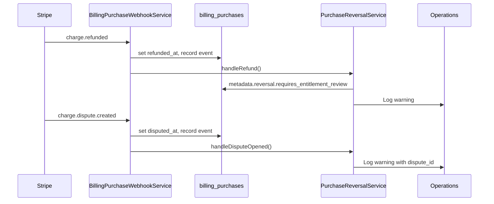

# Phase 9: Billing Hardening and Launch Readiness

Phase 9 prepares the embedded checkout billing system (`billing_purchases`) for production rollout while **keeping legacy Stripe Checkout Session code in place** until monitoring confirms a safe deprecation window.

## What Was Implemented

| Area | Deliverable |
|------|-------------|
| Legacy audit | Deprecation markers on remaining Checkout Session paths; audit table below |
| Purchase history | `GET /dashboard/purchases` + sidebar link |
| Refund/dispute | Webhook handlers for `charge.refunded` and `charge.dispute.created` |
| Reconciliation | `billing:reconcile-purchases` command (hourly schedule) |
| Monitoring | `billing:health` command + daily `--alert` schedule |
| Production config | `config/billing.php` monitoring + webhook event list |
| Indexes | Migration `2026_06_16_200000_add_billing_monitoring_indexes` |

---

## 1. Production Readiness Checklist

### Stripe (live mode)

- [ ] Live `STRIPE_KEY` and `STRIPE_SECRET` configured (`sk_live_…` prefix)
- [ ] Primary webhook endpoint registered: `POST /api/v1/billing/webhooks/stripe`
- [ ] Webhook events enabled: `payment_intent.succeeded`, `payment_intent.payment_failed`, `charge.refunded`, `charge.dispute.created`
- [ ] `STRIPE_WEBHOOK_SECRET` matches the **primary** endpoint signing secret
- [ ] Legacy endpoint `/stripe/webhook` kept active during rollout (same or separate secret documented)
- [ ] Stripe Dashboard products/prices match `config/billing.php` product codes and amounts
- [ ] CSP allows Stripe domains in production (`SecurityHeaders` middleware)

### Application

- [ ] `php artisan migrate` applied (including monitoring indexes)
- [ ] Scheduler running (`billing:reconcile-purchases` hourly, `billing:health --alert` daily)
- [ ] `MYDUALIST_BILLING_UNFULFILLED_ALERT_THRESHOLD` set appropriately (default: 5)
- [ ] Optional `MYDUALIST_BILLING_ALERT_SLACK_WEBHOOK` configured for ops channel
- [ ] `SANCTUM_STATEFUL_DOMAINS` includes production app domain(s)
- [ ] Rate limiters `billing` and `billing-purchase-read` verified under expected traffic
- [ ] Purchase history page accessible to authenticated users
- [ ] Upgrade, submissions, community dua, and welcome flows use `billing.purchases.start`

### Validation (staging → production)

- [ ] End-to-end test purchase per product code in test mode
- [ ] Webhook delivery confirmed in Stripe Dashboard for primary endpoint
- [ ] `billing:health` returns no alerts after successful test purchases
- [ ] `billing:reconcile-purchases --dry-run` shows zero unexpected mismatches
- [ ] Refund test in Stripe test mode sets `refunded_at` and creates `charge.refunded` event
- [ ] Dispute simulation (test mode) sets `disputed_at` and creates `charge.dispute.created` event

### Post-launch (first 7 days)

- [ ] Monitor `billing.health.alert` log channel daily
- [ ] Review unfulfilled succeeded purchases (`billing:health` metric)
- [ ] Compare Stripe payout report vs `billing_purchases` totals
- [ ] Confirm legacy Checkout Session volume trending to zero
- [ ] Document any refunds/disputes requiring entitlement review

---

## 2. Legacy Code Audit

**Policy:** Do not remove legacy code until embedded checkout volume is stable and legacy traffic is negligible for at least one billing cycle.

### Legacy (Checkout Session) — keep, deprecated

| Component | Path | Status | Replacement |
|-----------|------|--------|-------------|
| Web checkout | `BillingController::checkout`, `billing.checkout` route | `@deprecated` on route | `billing.purchases.start` |
| Success redirect | `BillingController::success`, `billing.success` | Active for in-flight sessions | Embedded checkout success URL |
| Legacy webhook | `POST /stripe/webhook` | Active | `POST /api/v1/billing/webhooks/stripe` |
| Stripe service | `StripeCheckoutService` | `@deprecated` | `StripePaymentIntentService` |
| Premium checkout start | `StartPremiumCheckoutAction` | `@deprecated` | `StartEmbeddedPurchaseCheckoutAction` |
| Premium fulfillment | `FulfillPremiumCheckoutAction` | `@deprecated` | `PurchaseFulfillmentService` |
| Community checkout start | `StartPaidCommunityDuaCheckoutAction` | `@deprecated` | `StartPaidCommunityDuaPurchaseAction` |
| Community fulfillment | `FulfillPaidCommunityDuaCheckoutAction` | `@deprecated` | `CommunityDuaPaidFulfillmentHandler` |
| API checkout | `CheckoutController` (API v1) | `@deprecated` | `PurchaseController` |
| Data model | `StripePayment`, Filament `StripePaymentResource` | Active (historical) | `BillingPurchase` |
| Admin stats | `PlatformStatsOverview` (legacy payments) | Active | Extend to include `BillingPurchase` (future) |
| Community success | `CommunityDuaController::success` (`?session_id=`) | Active for legacy | Embedded checkout redirect |

### New system (source of truth)

| Component | Path |
|-----------|------|
| Purchases | `BillingPurchase`, `BillingPurchaseEvent` |
| Webhooks | `BillingPurchaseWebhookService` |
| Fulfillment | `PurchaseFulfillmentService` + handlers |
| Embedded UI | `PurchaseCheckoutController`, `billing-checkout.js` |
| Upgrade entry | `StartEmbeddedPurchaseCheckoutAction` |
| Purchase history | `PurchaseHistoryController`, `dashboard.purchases` |
| Reconciliation | `PurchaseReconciliationService`, `billing:reconcile-purchases` |
| Health | `BillingHealthService`, `billing:health` |
| Refund/dispute | `PurchaseReversalService` (recording + ops flags) |

### Deprecation removal criteria (future phase)

1. Zero legacy Checkout Session creations for 30 days
2. No open disputes on legacy `stripe_payments` rows
3. `billing:health` clean for 14 consecutive days
4. Ops sign-off on entitlement reversal policy for refunds

---

## 3. Recommended Database Indexes and Monitoring

### Existing indexes (`billing_purchases`)

- `status`, `fulfilled_at`, `refunded_at`, `disputed_at`
- Unique `payment_intent_id`
- Composite `[user_id, status]`, `[billing_product_id, status]`

### Added in Phase 9

| Table | Index | Purpose |
|-------|-------|---------|
| `billing_purchases` | `[user_id, created_at]` | Purchase history pagination |
| `billing_purchase_events` | `stripe_event_id` | Webhook idempotency lookups |
| `billing_purchase_events` | `created_at` | Recent failure / audit queries |

### Monitoring metrics (`billing:health`)

| Metric | Alert condition |
|--------|-----------------|
| `unfulfilled_succeeded_purchases` | ≥ threshold (default 5) |
| `recent_webhook_failures` | > 0 in 24h (`webhook.failure` events) |
| `stripe_configured` | false in any environment |
| `stripe_live_mode` | false when `APP_ENV=production` |
| `refunded_purchases` / `disputed_purchases` | Informational (no auto-alert) |

### Log signals

| Log key | Meaning |
|---------|---------|
| `billing.purchase.refunded` | Refund recorded; check `requires_entitlement_review` in metadata |
| `billing.purchase.disputed` | Dispute opened; manual review required |
| `billing.health.alert` | Threshold breach; Slack if configured |

### Recommended external monitoring

- Uptime check on `GET /up`
- Stripe webhook delivery failure alerts (Stripe Dashboard)
- Daily job success for `billing-reconcile-purchases` and `billing-health-alert` (scheduler heartbeat)
- Optional: Datadog/Sentry alert on `billing.health.alert` log pattern

---

## 4. Refund and Dispute Architecture

### Event flow



### Current behavior (Phase 9)

- **Recording only:** `refunded_at` / `disputed_at` timestamps and immutable `billing_purchase_events` rows
- **Metadata flags:** `metadata.reversal.requires_entitlement_review` when refund hits a fulfilled purchase
- **No automatic entitlement reversal** — intentional until product policy is signed off

### Planned entitlement reversal (Phase 10+)

| Product | Reversal strategy |
|---------|-------------------|
| `REQUEST_PACK_25` | Re-lock submissions unlocked by `unlock_purchase_id` (up to pack size) |
| `UNLIMITED_ONE_LIST` | Remove list-scoped unlimited grant; re-apply free tier visibility cap |
| `ADDITIONAL_LIST` | Revoke `EntitlementGrant`; archive excess list if over free limit |
| `UNLIMITED_FOREVER` | Revoke user-scoped premium grant |
| `COMMUNITY_DUA_PAID` | Deactivate community dua; remove from queue |

### Operational handling

| Scenario | Action |
|----------|--------|
| Full refund, fulfilled | Review grants/submissions; apply reversal handler when available |
| Partial refund | Record event; manual review (stackable packs may need proportional lock) |
| Dispute opened | Pause entitlement changes; gather evidence in Stripe Dashboard |
| Dispute won | No entitlement change; clear ops flag |
| Dispute lost | Treat as refund; apply reversal |

### Stripe Dashboard

- Respond to disputes within Stripe's deadline
- Link dispute to `billing_purchases.payment_intent_id` for lookup

---

## 5. Reconciliation Strategy

### Purpose

Heal drift between Stripe Payment Intent state and local `billing_purchases` when webhooks are delayed, missed, or processed out of order.

### Command

```bash
php artisan billing:reconcile-purchases              # all candidates
php artisan billing:reconcile-purchases --purchase=123
php artisan billing:reconcile-purchases --dry-run  # report only
```

### Candidate selection

Purchases with `payment_intent_id` where:

- `status = succeeded` AND `fulfilled_at IS NULL`, OR
- `status IN (processing, requires_confirmation)`

### Actions per purchase

1. Retrieve Payment Intent from Stripe
2. Map Stripe status → `BillingPurchaseStatus`
3. Update local status if mismatched
4. Record `reconcile.attempt` event (hourly idempotency bucket)
5. If succeeded and unfulfilled → run `PurchaseFulfillmentService`

### Schedule

- **Hourly:** `billing:reconcile-purchases` via Laravel scheduler
- **Manual:** after webhook outages or deploys

### Limits

- Does not create Payment Intents
- Does not process refunds/disputes (webhook-driven)
- Stripe API errors logged per purchase; command exits non-zero if any failures

---

## 6. Deployment Checklist

### Pre-deploy

1. Merge Phase 9 to release branch
2. Run full test suite: `php artisan test --filter=Billing`
3. Apply migrations on staging
4. Configure staging Stripe webhook to primary endpoint
5. Run production readiness checklist on staging
6. Brief ops on refund/dispute runbook (below)

### Deploy

1. Enable maintenance mode if required
2. `php artisan migrate --force`
3. Deploy application code
4. `php artisan config:cache` / `php artisan route:cache` (if used in prod)
5. Verify scheduler worker restarted
6. Smoke test: create test purchase in staging/production canary

### Post-deploy

1. `php artisan billing:health`
2. `php artisan billing:reconcile-purchases --dry-run`
3. Confirm Stripe webhook endpoint returns 204 on test event
4. Verify purchase history page loads
5. Monitor logs for 1 hour

### Production Stripe configuration

```env
STRIPE_KEY=pk_live_...
STRIPE_SECRET=sk_live_...
STRIPE_WEBHOOK_SECRET=whsec_...   # primary endpoint secret

MYDUALIST_BILLING_UNFULFILLED_ALERT_THRESHOLD=5
MYDUALIST_BILLING_ALERT_SLACK_WEBHOOK=https://hooks.slack.com/...
```

Register webhook URL: `https://{domain}/api/v1/billing/webhooks/stripe`

Keep legacy `/stripe/webhook` until legacy traffic ends.

---

## 7. Rollback Plan

### When to rollback

- Widespread payment failures (>5% checkout errors)
- Webhook processing failures causing mass unfulfilled purchases
- Critical security issue in checkout or webhook handling

### Immediate actions (no code removal)

1. **Feature flag via routing:** Re-enable legacy checkout links in Blade templates (revert Phase 8 UI commits only) — legacy backend still present
2. **Disable new entry point:** Comment or env-guard `billing.purchases.start` route (last resort)
3. **Stripe:** Point marketing CTAs to legacy flow if re-enabled
4. **Webhooks:** Ensure legacy `/stripe/webhook` remains registered

### Application rollback

1. Redeploy previous release artifact
2. `php artisan migrate:rollback` **only if** Phase 9 migration causes issues (index migration is safe to keep)
3. Run `billing:reconcile-purchases` to clear backlog after recovery
4. Run `billing:health --alert`

### Data integrity

- `billing_purchases` rows are append-only for audit; do not delete on rollback
- Use reconciliation to fulfill any succeeded purchases missed during incident
- Refunds/disputes remain recorded; ops handles entitlements manually during rollback window

### Recovery validation

- [ ] `billing:health` alerts cleared
- [ ] Unfulfilled succeeded count = 0
- [ ] Sample purchases fulfill correctly
- [ ] Stripe webhook delivery green in Dashboard

---

## Operational Runbooks

### Runbook: Unfulfilled succeeded purchase

1. Find purchase: `billing_purchases` where `status=succeeded` and `fulfilled_at` is null
2. Check `billing_purchase_events` for `payment_intent.succeeded`
3. Check Stripe PI status in Dashboard
4. Run `php artisan billing:reconcile-purchases --purchase={id}`
5. If still unfulfilled, check fulfillment logs and product handler mapping
6. Local/testing only: `php artisan billing:confirm-purchase --purchase={id}`

### Runbook: Refund received

1. Locate purchase by `payment_intent_id` or Stripe charge
2. Confirm `refunded_at` and `charge.refunded` event exist
3. Check `metadata.reversal.requires_entitlement_review`
4. If true, manually review entitlements (reversal automation pending Phase 10)
5. Document action in support ticket

### Runbook: Dispute opened

1. Locate purchase via Stripe dispute `payment_intent`
2. Confirm `disputed_at` set locally
3. Respond in Stripe Dashboard before deadline
4. Do not modify entitlements until outcome known
5. If lost, follow refund runbook

### Runbook: Webhook outage

1. Check Stripe Dashboard → Webhooks → delivery failures
2. Fix endpoint (503 often = missing `STRIPE_WEBHOOK_SECRET`)
3. Replay failed events from Stripe Dashboard
4. Run `php artisan billing:reconcile-purchases`
5. Run `php artisan billing:health --alert`

### Runbook: Legacy session still completing

1. Expected during rollout — do not remove legacy handlers
2. `billing.success` and `FulfillPremiumCheckoutAction` process session
3. Track volume; target zero new legacy sessions before removal

---

## Files Added/Changed (Phase 9)

| File | Change |
|------|--------|
| `PurchaseReversalService` | Refund/dispute metadata + logging |
| `PurchaseReconciliationService` | Stripe PI reconciliation |
| `BillingHealthService` | Metrics and alerts |
| `BillingPurchaseWebhookService` | `charge.refunded`, `charge.dispute.created` |
| `ReconcileBillingPurchasesCommand` | `billing:reconcile-purchases` |
| `BillingHealthCommand` | `billing:health` |
| `PurchaseHistoryController` | Dashboard purchase history |
| `dashboard/purchases.blade.php` | Purchase history UI |
| `config/billing.php` | Monitoring + production webhook list |
| `routes/console.php` | Scheduled reconcile + health |
| Migration | Monitoring indexes |
| Legacy classes | `@deprecated` annotations |

## Tests

```bash
php artisan test tests/Feature/Api/V1/Billing/RefundDisputeWebhookTest.php
php artisan test tests/Feature/Billing/ReconcileBillingPurchasesCommandTest.php
php artisan test tests/Feature/Billing/PurchaseHistoryTest.php
```
