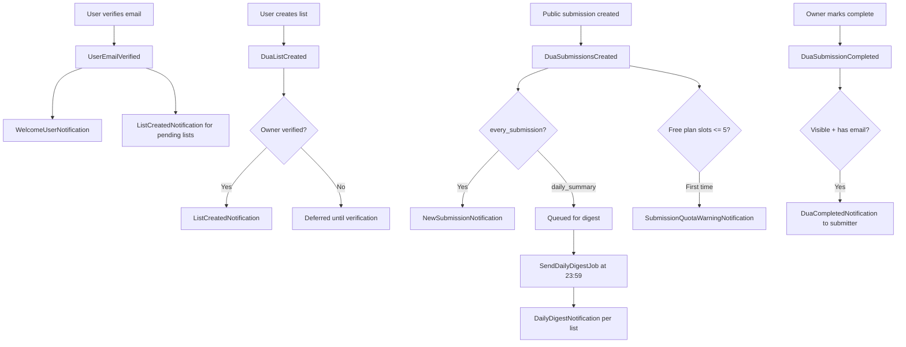

# Email System

This document describes the transactional email architecture for the MyDualist Laravel application.

## Overview

Transactional emails are implemented with Laravel Notifications, queued via `ShouldQueue`, and dispatched from domain events or scheduled jobs. Business rules and idempotency live in service classes (`TransactionalEmailService`, `DailyDigestService`); notification classes only format messages.

Reminder emails (no-activity, closing-soon, list-image) are implemented via `ReminderEmailService` and scheduled jobs.

## Completion email variants

`DuaCompletedNotification` branches on list occasion:

| Occasion | Template | Subject |
|----------|----------|---------|
| `salawat` | `mail.dua-completed-salawat` | `{owner} has completed your salawat request` |
| All others | `mail.dua-completed` | `{owner} Just Completed Your Dua Request` |

### Salawat vs standard content

Salawat completion emails use salawat-specific copy (conveying salam to the Prophet, hadith quote, create-list CTA) and omit the dua message panel shown in standard completion emails.

### Fundraising block (`{fundraising_content}`)

WordPress injects a per-list creator fundraising block into standard completion emails when `listMode = creator` and both `donationLink` and `donationNote` are set on the list.

Laravel does **not** store per-list donation links or notes on `dua_lists`, so this block is intentionally omitted. Standard completion emails instead link to the global Donorbox and Trustpilot URLs. Salawat completion emails never included `{fundraising_content}` in the WordPress template either.

## Notification flow



## Notifications

| Notification | Recipient | Subject | Trigger |
|--------------|-----------|---------|---------|
| `WelcomeUserNotification` | User | Welcome to My Dua List | First successful email verification |
| `ListCreatedNotification` | List owner | `{name}, Your Dua List is Ready – Explore Our Key Features!` | List created while verified, or on verification for pending lists |
| `NewSubmissionNotification` | List owner | You Just Received A Dua Request | Public submission when `email_frequency = every_submission` |
| `DailyDigestNotification` | List owner | You Just Received A Dua Request | Scheduled digest for `email_frequency = daily_summary` |
| `DuaCompletedNotification` | Submitter email | `{owner} Just Completed Your Dua Request` (standard) or `{owner} has completed your salawat request` (Salawat lists) | Submission marked complete (visible slot, has email) |
| `SubmissionQuotaWarningNotification` | List owner | Your Dua List is Full – Time to Upgrade for More Requests! | Free plan visible slots cross from >5 to ≤5 remaining (once per list) |

### Idempotency

| Email | Guard column |
|-------|----------------|
| Welcome | `users.welcome_email_sent_at` |
| List created | `dua_lists.list_created_email_sent_at` |
| Completion | `dua_submissions.completion_notified_at` (cleared if reverted to pending) |
| Quota warning | `dua_lists.submission_quota_warning_sent_at` |
| Daily digest (per submission) | `dua_submissions.digest_sent_at` |

Immediate submission emails are sent per submission event. Digest submissions remain pending until `digest_sent_at` is set by `DailyDigestService`.

## Daily digest workflow

### Behaviour

Lists with `email_frequency = daily_summary` do **not** receive immediate `NewSubmissionNotification` emails. Instead, public submissions accumulate until the scheduled digest runs.

WordPress parity:

- One digest email per list per run
- Subject: **You Just Received A Dua Request**
- Includes a table of submitter names and dua previews
- Runs once daily at **23:59** (application timezone, UTC by default)

### Eligible submissions

A submission is included when all of the following are true:

- Belongs to a list with `email_frequency = daily_summary`
- `digest_sent_at` is `null`
- `is_personal_dua` is `false`
- Status is pending or completed (`visible` scope)
- Visible to the list owner under free-plan limits (`UserEntitlementService::canViewSubmission`)

### Processing

`SendDailyDigestJob` calls `DailyDigestService::sendPendingDigests()` which:

1. Finds lists with pending digest submissions (chunked, default 50 lists per batch)
2. Locks pending submissions per list inside a database transaction
3. Sends one `DailyDigestNotification` to the list owner
4. Sets `digest_sent_at` on all included submissions

If the job fails before the transaction commits, submissions remain pending and are retried on the next run without duplicate sends.

### Scheduler

Registered in `routes/console.php`:

```php
Schedule::job(new SendDailyDigestJob)
    ->dailyAt(config('mydualist.notifications.daily_digest_at', '23:59'))
    ->name('send-daily-digest');
```

Override the run time with `MYDUALIST_DAILY_DIGEST_AT` (24-hour `H:i` format).

## Event wiring

| Event | Dispatched from | Listener |
|-------|-----------------|----------|
| `UserEmailVerified` | `VerifyEmailAction` | `SendWelcomeAndPendingListEmails` |
| `DuaListCreated` | `CreateDuaListAction` | `SendListCreatedEmail` |
| `DuaSubmissionsCreated` | `CreateDuaSubmissionAction` | `SendSubmissionTransactionalEmails` |
| `DuaSubmissionCompleted` | `TransitionDuaSubmissionStatusAction` | `SendDuaCompletedEmail` |

Delivery logging:

| Event | Listener |
|-------|----------|
| `NotificationSent` (mail) | `LogEmailNotificationDelivery::handleSent` |
| `NotificationFailed` (mail) | `LogEmailNotificationDelivery::handleFailed` |

Logs are stored in `email_send_logs` and surfaced in the Filament **Email Health** widget.

## Templates

Branded HTML templates live under `resources/views/mail/`:

- `layout.blade.php` — shared responsive layout with light/dark client support
- `welcome-user.blade.php`
- `list-created.blade.php`
- `new-submission.blade.php`
- `daily-digest.blade.php`
- `dua-completed.blade.php`
- `submission-quota-warning.blade.php`

## Required SendLayer configuration

SendLayer is not configured in this repository. For production, set standard Laravel SMTP/mail transport environment variables (exact SendLayer values from your SendLayer dashboard):

```env
MAIL_MAILER=smtp
MAIL_HOST=<sendlayer-smtp-host>
MAIL_PORT=587
MAIL_USERNAME=<sendlayer-username>
MAIL_PASSWORD=<sendlayer-password>
MAIL_ENCRYPTION=tls
MAIL_FROM_ADDRESS=hello@mydualist.com
MAIL_FROM_NAME="MyDualist"
```

After updating `.env`:

```bash
php artisan config:cache
```

## Queue requirements

All transactional notifications implement `ShouldQueue`. A running queue worker is required in every non-local environment:

```bash
php artisan queue:work
```

See `docs/scheduler-setup.md` for Supervisor recommendations and restart procedures.

With `QUEUE_CONNECTION=sync` (PHPUnit default), notifications run inline during tests.

## Filament monitoring

The admin dashboard includes an **Email Health** widget showing:

- Emails sent today (from `email_send_logs`)
- Daily digests sent today
- Pending digest submissions (`digest_sent_at` is null on `daily_summary` lists)
- Failed emails today
- Last sent / last digest timestamps in stat descriptions

Queue and scheduler health remain on the **System Health** widget.

## Verification steps

### Confirm notifications are queued

```bash
php artisan tinker
>>> $user = App\Models\User::factory()->create();
>>> $user->notify(new App\Domains\Notifications\Notifications\WelcomeUserNotification);
```

Then inspect the `jobs` table or Redis queue length.

### Confirm event wiring and digest behaviour

```bash
php artisan test tests/Feature/Notifications/TransactionalEmailTest.php
php artisan test tests/Feature/Notifications/DailyDigestTest.php
```

### Manually run the digest job

```bash
php artisan tinker --execute="app(App\Domains\Notifications\Services\DailyDigestService::class)->sendPendingDigests();"
```

### Confirm delivery logging

After a successful send with `MAIL_MAILER=log` or real SMTP:

```bash
php artisan tinker --execute="dump(App\Models\EmailSendLog::latest()->first());"
```

### Confirm Filament widget

Log in to `/admin` and review the **Email Health** widget on the dashboard.

## Troubleshooting

| Symptom | Likely cause | Action |
|---------|--------------|--------|
| No emails sent | Queue worker not running | Start `queue:work` or use `sync` locally |
| Emails in `failed_jobs` | SMTP/SendLayer misconfiguration | Check `MAIL_*` env vars and provider dashboard |
| Welcome not sent | User already has `welcome_email_sent_at` | Expected idempotency; clear only for testing |
| List email missing after onboarding | User not verified at list creation | Verify email; pending list emails send on verification |
| Owner not notified immediately | `email_frequency = daily_summary` | Expected; wait for digest or run `DailyDigestService` manually |
| Digest never sent | Scheduler cron or queue worker down | Check System Health widget; run `php artisan schedule:list` |
| Pending digest count stays high | Digest job failing | Inspect `failed_jobs` and `email_send_logs` |
| Submitter not notified on complete | Submission beyond free visible limit | Matches WordPress `_show = 0` behaviour |
| Widget shows zero emails | `NotificationSent` not firing | Ensure mail channel succeeded; check `email_send_logs` |

## Out of scope (future work)

- Per-list creator fundraising blocks in completion emails (requires `donationLink` / `donationNote` list fields)
- Mailchimp marketing integrations
